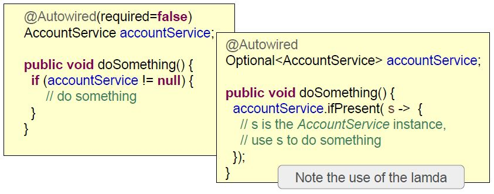
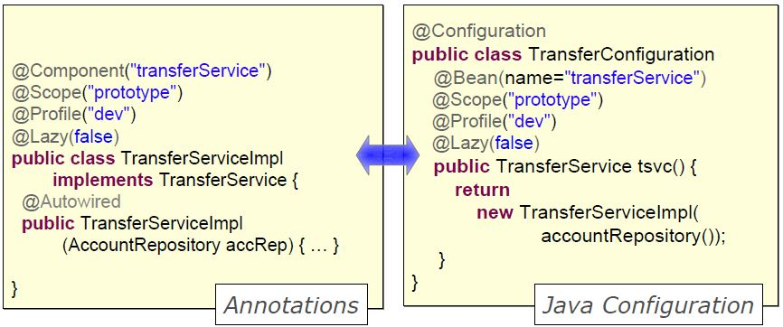

###	Annotation - based Configuration
#### Explicit Bean Definition

* Configuration is external to bean class :
	* Separation of concerns
	* Java-based dependency injection

```java
@Configuration
public class TransferModelConfig {

	@Bean
	public AccountRepository accountRepository(){
	...
	}

	@Bean
	public TransferService transferService(){
		return TransferServiceImpl( accountRepository () );		//Dependency Injection
	}
}
```

#### Implicit configuration
annotation-based configuration within bean-class

```java
@Component
public class TransferServiceImpl impements TransferService{
  // Bean id derived from classname: transferServiceImpl
	@Autowired
	public TransferServiceImpl(AccountRepository repo){
    // annotation embedded with POJO
		this.accountRepository= repo;
	}
}
```

```java
@Configuration
@ComponentScan("com.bank")		//find @Component classes within designated(sub) packages
public class AnnotationConfig{
	//no bean definition needed any more
}
```

#### Usage of **@Autowired**
* Constructor-injection
```java
@Autowired
public TransferServiceImpl(AccountRepository repo){
	this.accountRepository= repo;
}
```
* Method-injection
```java
@Autowired
public setAccountRepository(AccountRepository a){
	this.accountRepository= a;
}
```
* Field-injection
```java
@Autowired
private AccountRepository accountRepository;
//Even when field is private !! - but hard to unit test,
// see URL: http://olivergierke.de/2013/11/why-field-injection-is-evil/
```

Unique dependency of correct **type** must exist.
</br>
##### @Autowired depencencies required or not ?
* default behavior: required
```java
@Autowired
public setAccountRepository(AccountRepository a){
	this.accountRepository= a;
}
```
==> Exception if no dependency found.
* use required attribute to override default behavior
```java
@Autowired(required=false)
public setAccountRepository(AccountRepository a){
	this.accountRepository= a;
}
```
Only injected if dependency exists.

##### Java 8 Optional
Another way to inject optional dependencies.
</br>
**Optional** introduced to reduce null pointer errors

<p align="center">
  
</p>

### Constructor Vs Setter Dependency injection
Spring doesn't care. But which is the best ?


| constructors                | Setters                               |
| --------------------------- |---------------------------------------|
| Mandatory dependencies      | Optional/ changeable dependencies     |
| Immutable dependencies      | Circular dependencies                 |
| Concise                     | Inherited automatically               |
|                             | If constructor needs too many params  |


Follow the same rules  as standard Java
  * Be consistent across your project team
  * Many class use both

### Autowired & Disambiguation
```java
@Component
public class TransferServiceImpl implements TransferService {
public TransferServiceImpl(AccountRepository accountRepository){ ...}
}
```
```java
@Component
public class JpaAccountRepository implements AccountRepository { }
```
```java
@Component
public class JdbcAccountRepository implements AccountRepository { }
```
Which one should get injected ?
</br>
At startup: No such Bean Definition Exception, no unique bean of type [AccountRepository] is defined: expected single bean but found 2 ...

#### Use of the **@Qualifier**
```java
@Component
public class TransferServiceImpl implements TransferService {
                              // qualifier
public TransferServiceImpl( @Qualifier("jdbcAccountRepository")AccountRepository accountRepository){ ...}
}
```
```java
@Component("jpaAccountRepository")  // bean ID
public class JpaAccountRepository implements AccountRepository { }
```
```java
@Component("jdbcAccountRepository")
public class JdbcAccountRepository implements AccountRepository { }
```
* Autowired resolution rules :
  * Look for unique bean of required type
  * Use @Qualifier if supplied
  * Try to find a matching bean by name


* When component name is not specified names are auto generated :
  * De-capitalized non qualified classname by default
  * But will pick up implementation details from  classname
  </br>
  !! Recommendation : never rely on generated names !!
* When component name is specified it allows disambiguation when 2 bean classes implement the same interface.
</br>

Common strategy: avoid using qualifiers when possible
</Br>
Usually rare to have 2 beans of same type in the ApplicationContext

### Using @Value to set Attributes
you can use $ variables or SpEL
* Constructor-injection
```java
@Autowired
public TransferServiceImpl( @Value("${daily.limit}") int max){
  this.maxTransfersPerDay = max ;
}
```
* Method-injection
```java
@Autowired
public void setDailyLimit (@Value("$daily.limit")int max){
  this.maxTransfersPerDay = max ;
}
```
* Field-injection
```java
@Value("#{environment['daily.limit']}")
int maxTransfersPerDay;     // Not private so we can initialize in a unit test
```

### Java Config Vs Annotation syntax
Similar options are available:
<p align="center">
  
</p>

Components are scanned at startup : JAR dependencies also scanned. That could result slower startup time if too many files scanned especially for large applications. And it can be a few seconds in the worst case.
#### So what are the best practices ?
```java
//Really bad  : All "org" and "com" packages in the classpath will be scanned !
@ComponentScan({"org", "com"})
//Still bad
@ComponentScan({"org"})
//OK
@ComponentScan({"org.bank.app"})
// Optimized
@ComponentScan({"org.bank.app.repository", "com.bank.app.service" ," com.bank.app.controller"})
```
#### When use what ?
Java Configuration
* Pros :
  * Is centralized in one ( or a few ) places
  * Write any java code you need
  * Strong type checking enforced  by compiler (and IDE)
  * Can be used for all classes ( not just your own )
* Cons
  * More verbose  than annotations


Annotation
</Br>
Nice for your own beans
* Pros
 	* Single place to edit (just the class)
 	* Allows for very rapid development
* Cons
 	* Configuration spread across your code base (harder to debug / maintain)
 	* Only work for your own
 	* Merges configuration and code ( bad separation of concerns )

You can mix  Java configuration and Annotation and match in any ways
</Br>
Common approach :
Use annotations whenever possible (your classes), but sill use Java Configuration for third-part beans that aren't annotated or for legacy code that can't be changed.


### Delay Initialization
Beans normally create on startup when application context is created. **Lazy** bean are created first time when dependency injected by **ApplicationContext.getBean** methods.
</Br>
It's useful if bean's dependencies not available at startup.
```java
@Lazy
@Component
public class MailService{
  public MailService( @value("smtp:...")String url){
    // connect to mail-server
  }
}
```
