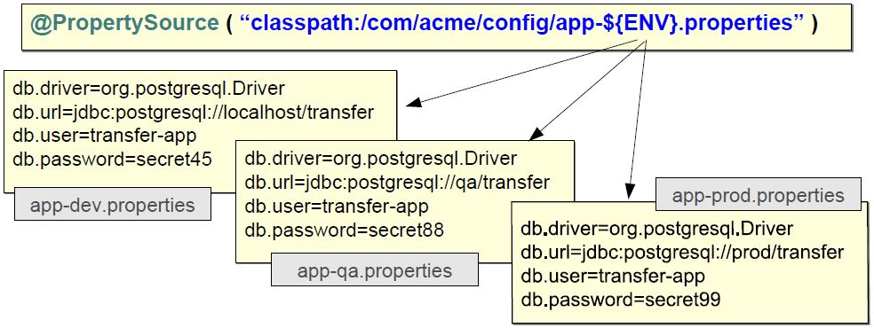

### External Properties:
```java
@Bean
public DataSource dataSource(){
	BasicDataSource dataSource = new BasicDataSource();
	dataSource.setDriveClassName("org.posgresql.Driver");
	dataSource.setUrl(jdbc:postgresql://localhost/transfert");
	dataSource.setUsername("transfert-app");
	dataSource.setPassword("secret45");
	return dataSource;
}
```

Unwise to hard-code DB connection parameters => "Externalize" this properties file
* properties from many sources :
	* JVM System Properties
	* Java properties Files
	* Servlet context Parmeters
	* system Environment Variables
	* JNDI

Environment object used to obtain properties from runtime environment

```java
@Configuration
public class AppConfig{
	//Property names
	private static final String DB_DRIVER="db.driver";
	private static final String DB_URL="db.url";
	private static final String DB_USER="db.user";
	private static final String DB_PWD="db.password";

	@Autowired
	Environment env;

	@Bean
	public DataSource dataSource(){
		BasicDataSource dataSource = new BasicDataSource();
	// Fetch property values from environment
		dataSource.setDriveClassName(env.getProperty(DB_DRIVER));
		dataSource.setUrl(env.getProperty(DB_URL);
		dataSource.setUsername(env.getProperty(DB_USER);
		dataSource.setPassword(env.getProperty(DB_PWD);
		return dataSource;
	}
}
```

* Environment obtains values from "property sources", environment  variables and java system properties always populated automatically.
* **@PropertiySource** contributes additional properties
	available resource prefixes:  classpath: file: http:

```java
@Configuration
@PropertySource("classpath:/com/organization/config/app.properties")
@PropertySource("file:config/app.properties")
  // adds properties from these files in addition to environment variables and system properties
public class AppConfig{
..
}
```

Accessing Properties using **@Value**
```java
@Configuration
public class AppConfig{
	@Bean
	public DataSource dataSource(){
      // Convenient alternative to explicitly using Environment
		@Value("${db.driver}")String driver ;
		@Value("${db.url}")String url ;
		@Value("${db.user}")String user ;
		@Value("${db.password}")String password ;
	BasicDataSource dataSource = new BasicDataSource();
	dataSource.setDriveClassName(driver);
	dataSource.setUrl(url);
	dataSource.setUsername(user);
	dataSource.setPassword(password);
	return dataSource;
	}
}
```
But How are these  ${..} variables resolved ?
* **${...}** variables are evaluated by a dedicates Spring bean **PropertiySourcesPlaceholderConfigurer**
* Note make this a **static** bean ensures ${..}placeholder expressions are evaluated before any beans are created that might use them.
( Spring Boot does this for you automatically )

```java
@Bean
public static PropertiySourcesPlaceholderConfigurer pspc(){
  return PropertiySourcesPlaceholderConfigurer();
      // ${..} placeholders are not resolved unless this bean declared
}
```

${...} placeholders in **@PropertiySource** are resolved against existing properties such as System properties or Environment variables.
```java
@PropertiySource("classpath:/com/acme/config/app-${ENV}.properties")
```

<p align="center">
  
</p>
