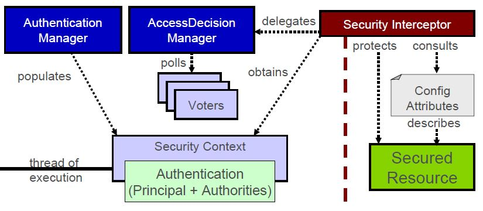
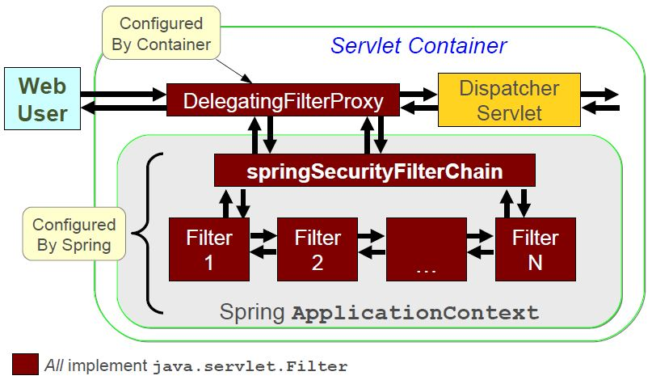
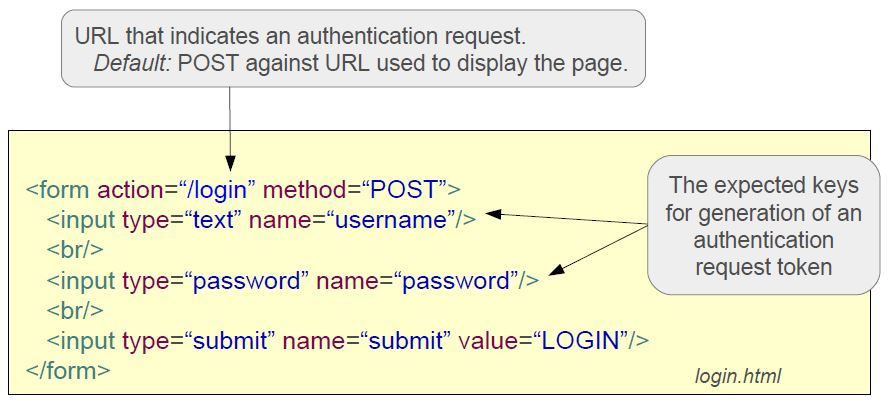
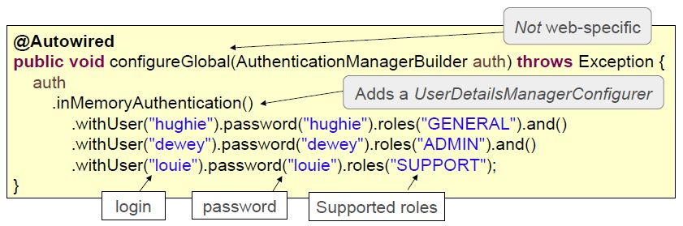
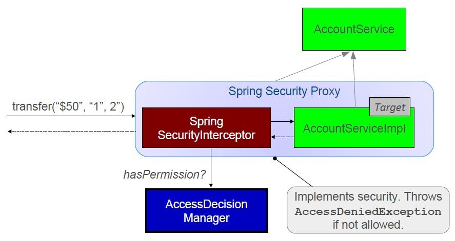

### Spring_Security

#### Security Concepts
* **Principal**: User, device or system that performs an action
* **Authentication**: Establishing that a principal’s credentials are valid
	* There are many authentication mechanisms (e.g. basic, digest, form, X.509)
	* There are many storage options for credential and authority information( e.g. Database, LDAP, in-memory (development))
* **Authorization**: Deciding if a principal is allowed to perform an action
	* Authorization depends on authentication, before deciding if a user can perform an action, user identity must be established
	* Authorization determines if you have the required Authority
	* The decision process is often based on roles
		*  ADMIN can cancel orders
		*  MEMBER can place orders
		*  GUEST can browse the catalog
	!! A Role is simply a commonly used type of Authority
* **Authority**: Permission or credential enabling access (such as a role)
* **Secured Item**: Resource that is being secured


#### Motivations
* Portable
	*  Secured archive (WAR, EAR) can be deployed as-is
	*  Also works with Spring Boot or standalone
	*  Uses Spring for configuration
* Separation of Concerns
	*  Business logic is decoupled from security concerns
	*  Authentication and Authorization are decoupled => Changes to the authentication process have no impact on authorization
* Flexibility
	*  Supports all common authentication mechanisms : Basic, Form, X.509, Cookies, Single-Sign-On, etc.
	*  Configurable storage options for user details (credentials and authorities) : Properties file, RDBMS, LDAP, custom DAOs, etc.
* Extensible
	*  All the following can be customized
		* How a principal is defined
		* How authorization decisions are made
		* Where security constraints are stored

#### Consistency of Approach
* The goal of authentication is always the same
	*  Regardless of the underlying mechanism
	*  Establish a security context with the authenticated principal’s information
	*  Out-of-the-box this works for web applications
* The process of authorization is always the same
	*  Regardless of the underlying mechanism
	*  Consult the attributes of secured resource
	*  Obtain principal information from security context
	*  Grant or deny access

<p align="center">
	  
</p>


### Setup and Configuration
#### Spring Security in a Web Environment
Three steps
*  1) Setup filter chain
*  2) Configure security (authorization) rules
*  3) Setup Web Authentication

Spring Security is not limited to Web security, but that is all we will consider here, and it is configurable “out-of-the-box”

#### Spring Security Filter Chain
* Implementation is a chain of Spring configured filters
	* Requires a **DelegatingFilterProxy** which must be called **springSecurityFilterChain**
	* Chain consists of many filters
* Setup filter chain using one of these options
	* Spring Boot does it automatically
	* Subclass AbstractSecurityWebApplicationInitializer
	* Declare as a <filter> in web.xml

!!!!For more details (and non-Boot examples) see “Advanced security: working with filters” at end of this topic.

<p align="center">
	  
</p>

#### Configuration in the Application Context
*  Extend WebSecurityConfigurerAdapter

```java
@Configuration
@EnableWebSecurity
public class SecurityConfig extends WebSecurityConfigurerAdapter {
	@Override
	protected void configure(HttpSecurity http) throws Exception {
		//Web-specific security settings
	}
	@Autowired
	public void configureGlobal(AuthenticationManagerBuilder auth)throws Exception {
		//Global security settings (authentication manager, ...).
	}
}
```
#### Authorizing URLs
* Define specific authorization restrictions for URLs
* Support “Ant-style” pattern matching
	* "/admin/*" only matches "/admin/xxx"
	*  "/admin/**" matches any path under /admin  Such as "/admin/database/access-control"

```java		
protected void configure(HttpSecurity http) throws Exception {
http.authorizeRequests()
	.antMatchers("/admin/**")	//Match all URLs starting  with /admin (ANT-style path)
	.hasRole("ADMIN")			//User must have ADMIN role
…
}
```


#### URL Matching
* antMatchers() vs mvcMatchers

```java
	http.authorizeRequests()
	// Only matches /admin
	.antMatchers("/admin").hasRole("ADMIN")
	// Matches /admin, /admin/, /admin.html, /admin.xxx
	.mvcMatchers("/admin").hasRole("ADMIN")
```

* mvcMatchers
 	* Newer API
 	* Uses same matching rules as @RequestMapping
 	* Typically more secure, recommended


* More on authorizeRequests()
* Chain multiple restrictions evaluated in the order listed
* First match is used, put specific matches first

```java
protected void configure(HttpSecurity http) throws Exception {
http
.authorizeRequests()
.mvcMatchers("/signup", "/about").permitAll()
.mvcMatchers("/accounts/edit*").hasRole("ADMIN")
.mvcMatchers("/accounts/**").hasAnyRole("USER",”ADMIN”)
.anyRequest().authenticated();
	//Must be authenticated for any other request
```

#### Specifying login and logout
```java
protected void configure(HttpSecurity http) throws Exception {
http
.authorizeRequests()
.mvcMatchers("/admin/**").hasRole("ADMIN")...
.and() // method chaining!
.formLogin() // setup form-based authentication
.loginPage("/login") // URL to use when login is needed
.permitAll() // any user can access
.and() // method chaining!
.logout() // configure logout
.logoutSuccessUrl("/home") // go here after successful logout
.permitAll(); // any user can access
}
```

#### An Example Login Page
<p align="center">
	  
</p>


#### By-passing Security
*  Some URLs do not need to be secure such as static resources using permitAll() allows open-access, but still processed by Spring Security possible to skip security checks completely.

```java
@Configuration
@EnableWebSecurity
public class SecurityConfig extends WebSecurityConfigurerAdapter {
@Override
protected void configure(WebSecurity web) throws Exception {
		//These URLs pass straight through, no checks
web.ignoring().mvcMatchers("/css/**", "/images/**", "/javascript/**");  
}
```


#### Configure Authentication
*  DAO Authentication provider is default
	*  Expects a UserDetailsService implementation to provide credentials and authorities
*  Options: In-memory (properties), JDBC (database), Custom
*  **LdapAuthenticationProvider** Integrate with OpenLDAP or Active Directory or define your own Authentication provider ( Example: to get pre-authenticated user details when using single sign-on, CAS, TAM, SiteMinder ... )


#### Authentication Manager
*  Use a UserDetailsManagerConfigurer
	*  Some built in options: in-memory (for quick testing), JDBC
	*  Or use your own UserDetailsService implementation

<p align="center">
	  
</p>


#### Sourcing Users from a Database

```java
private DataSource dataSource;
@Autowired
public void setDataSource(DataSource dataSource) throws Exception {
this.dataSource = dataSource;;
}
@Autowired
public void configureGlobal(AuthenticationManagerBuilder auth) throws Exception {
auth.jdbcAuthentication().dataSource(dataSource);
			// Can customize queries using methods:
			// usersByUsernameQuery()
			// authoritiesByUsernameQuery()
			// groupAuthoritiesByUsername()

}
```

Queries RDBMS for users and their authorities
*  Provides default queries
 	* SELECT username, password, enabled FROM users WHERE username = ?
 	* SELECT username, authority FROM authorities WHERE username = ?
*  Groups also supported : groups, group_members, group_authorities tables
*  Advantage: can modify user info while system is running

#### Password Encoding
*  Can encode passwords using a hash: sha256, bcrypt, (sha, md5, …) with any authentication mechanism.
```java
auth.inMemoryAuthentication()
.passwordEncoder(new StandardPasswordEncoder());  // SHA-256 by default
```
*  Add a “salt” string to make encryption stronger (Salt prepended to password before hashing )
```java
auth.jdbcAuthentication()
.dataSource(dataSource)
.passwordEncoder(new StandardPasswordEncoder(“Spr1nGi$Gre@t”));  //encoding with a 'salt' string
```

Note: sha and md5 only suitable for testing --too insecure


*  BCrypt is recommended over SHA-256
 	* Secure passwords further by specifying a “strength” (N)
 	* Internally the hash is rehashed 2N times, default is 210
```java
auth.inMemoryAuthentication()
.passwordEncoder(new BCryptPasswordEncoder(12)); //Encoding using 'strength' 12
```
*  Store only encrypted passwords
```java
auth.inMemoryAuthentication()
.withUser("hughie")
.password("$2a$10$aMxNkanIJ...Ha.h5NKknelEuylt87PNlicYpI1y.IG0C.")
.roles("GENERAL")
```


BCryptPasswordEncoder is recommended  - uses Blowfish


Other Authentication Options
*  Implement a custom UserDetailsService that delegate to an existing User repository or DAO .
*  LDAP
*  X.509 Certificates
*  JAAS Login Module
*  Single-Sign-On : OAuth, SAML / SiteMinder, Kerberos /JA-SIG Central Authentication Service.

!! Authorization is not affected by changes to Authentication!


#### @Profile with Security Configuration

```java
public class SecurityBaseConfig extends WebSecurityConfigurerAdapter {
protected void configure(HttpSecurity http) throws Exception {
http.authorizeRequests().mvcMatchers("/resources/**").permitAll();
}
```

```java
}
@Configuration
@EnableWebSecurity
@Profile(“development”)	//Use in-memory provider
public class SecurityDevConfig extends SecurityBaseConfig {
@Override
public void configureGlobal(AuthenticationManagerBuilder auth) throws Exception {
auth.inMemoryAuthentication()
.withUser("hughie").password("hughie").roles("GENERAL");
}
}
```


```java
@Configuration
@EnableWebSecurity
@Profile(“!development”)	//Use database provider
public class SecurityProdConfig extends SecurityBaseConfig {
@Override
public void configureGlobal(AuthenticationManagerBuilder auth) throws Exception {
auth.jdbcAuthentication().dataSource(dataSource);
}
}
```

Use this profile when “development” not defined


#### Method Security
* Spring Security uses AOP for security at the method level
	* annotations based on Spring annotations or JSR-250 annotations
	* Java configuration to activate detection of annotations
* Typically secure your services
	* Do not access repositories directly, bypasses security (and transactions)

#### How it works

<p align="center">
	  
</p>


#### Method Security - JSR-250
*  Only supports **role-based** security (hence the name)
 	* JSR-250 annotations must be enabled

```java
@EnablleGlloballMetthodSecurriitty((jjsrr250Enablled=true))
```

```java
import javax.annotation.security.RolesAllowed; //Can also place at class level
public class ItemManager {
@RolesAllowed({"ROLE_MEMBER", "ROLE_USER"})
public Item findItem(long itemNumber) {
...
}
}
```

Internally role authorities are stored with ROLE_ prefix. APIs seen previously hide this. Here you must use full name

#### Method Security with SpEL
*  Use Pre/Post annotations for SpEL
```java
@EnableGlobalMethodSecurity(prePostEnabled=true)
```
```java
import org.springframework.security.annotation.PreAuthorize;
public class ItemManager {
@PreAuthorize("hasRole('MEMBER') && " +
"#order.owner.id == principal.user.id")
public Item findItem(Order order, long itemNumber) {
...
}
}
```
Full role-names not required. ROLE_ prepended automatically.


#### Summary
*  Spring Security
 	* Secure URLs using a chain of Servlet filters
 	* And/or methods on Spring beans using AOP proxies
*  Out-of-the-box setup usually sufficient  - you define:
 	* URL and/or method restrictions
 	* How to login (typically using an HTML form)
 	* Supports in-memory, database, LDAP credentials (and more)
 	* Password encryption using familiar hashing techniques
 	* Support for security tags in JSP views
