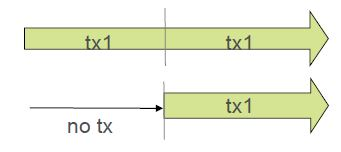

### Transaction Management with Spring
#### What is a Transaction?
 * A set of tasks which take place as a single, indivisible action : An Atomic, Consistent, Isolated, Durable operation.
 ( Acronym: **ACID** )

#### Why use Transactions? To Enforce the ACID Principles
 * Atomic: Each unit of work is an all-or-nothing operation
 * Consistent: Database integrity constraints are never violated
 * Isolated: Isolating transactions from each other
 * Durable: Committed changes are permanent


#### Transactions in the RewardNetwork
 The rewardAccountFor(Dining) method represents a unit-of-work that should be atomic.
 <p align="center">
 	  
 </p>
* **Naïve Approach: Connection per Data Access Operation**
   * This unit-of-work contains 4 data access operations, Each acquires, uses, and releases a distinct Connection
   * The unit-of-work is non-transactional
<p align="center">
   
</p>
Suppose an Account is being rewarded. If the beneficiaries are updated… But the reward confirmation fails… ==>  There will be no record of the reward!
<p align="center">
   
</p>
<p align="center">
   X The unit-of-work is not atomic
</p>


* **Correct Approach : Connection per Unit-of-Work **
   * More efficient: same Connection reused for each operation
   * Operations complete as an atomic unit: either all succeed or all fail
   * The unit-of-work can run in a transaction
<p align="center">
   
</p>


#### Java Transaction Management
  *  Java has several APIs which handle transactions differently : JDBC, JMS, JTA, Hibernate, JPA, etc.
  *  Each uses program code to mark the start and end of the transaction( Transaction Demarcation )
  *  Different APIs for Global vs Local transactions management
        *  Local Transactions - Single Resource : Transactions managed by underlying resource
      <p align="center">
         
      </p>
        *  Global (distributed) Transactions - Multiple : Transaction managed by separate, dedicated transaction manager
      <p align="center">
         
      </p>


#### JDBC Transaction Management Example


</Br></Br>
Local transactions only:
  * Code cannot 'join' a transaction already in progress
  * Code cannot be used with global transaction

</Br></Br>
#### JMS Transaction Management Example


</Br></Br>
Local transactions only:
* Code cannot 'join' a transaction already in progress
* Code cannot be used with global transaction


</Br></Br>
#### JPA / Hibernate Transaction Management
<p align="center">
   
</p>


#### Java Transaction API (JTA) Example
<p align="center">
   
</p>

Requires a JTA implementation:
  *  “Full” application server (WebSphere, WebLogic, JBoss, etc.)
  *  Standalone implementation (Atomikos, JTOM, etc.)


#### Problems with Java Transaction Management
  *  Multiple APIs for different local resources
  *  Programatic transaction demarcation
		* Typically performed in the repository layer (wrong place)
		* Usually repeated (cross-cutting concern)
  *  Service layer more appropriate
		* Multiple data access methods often called within a single transaction
		* But: don't want data-access code in service-layer
  *  Orthogonal concerns => Transaction demarcation should be independent of transaction implementation

#### Spring Transaction Management
  *  Spring separates transaction demarcation from transaction implementation
	* Demarcation expressed declaratively via AOP (Programmatic approach also available)
	* **PlatformTransactionManager** abstraction hides implementation details. ( Several implementations available )

  *  Spring uses the same API for global vs. local.
	* Change from local to global is minor => Just change the transaction manager

  *  There are only 2 steps
	* Declare a **PlatformTransactionManager** bean
	* Declare the transactional methods (Using Annotations, XML, Programmatic / Can mix and match)


#### PlatformTransactionManager
  *  Spring’s **PlatformTransactionManager** is the base interface for the abstraction
  *  Several implementations are available :
		* DataSourceTransactionManager
		* HibernateTransactionManager
		* JpaTransactionManager
		* JtaTransactionManager
		* WebLogicJtaTransactionManager
		* WebSphereUowTransactionManager
		* and more

Spring allows you to configure whether you use JTA or not.
</br>
It does not have any impact on your Java classes

#### Deploying the Transaction Manager
  *  Create the required implementation
* Just like any other Spring bean , Configure as appropriate
* Here is the manager for a DataSource

```java
@Bean
public PlatformTransactionManager transactionManager(DataSource dataSource) {
return new DataSourceTransactionManager(dataSource);
}
//A DataSource bean must be defined elsewhere
```

Bean id “transactionManager” is recommended name. Spring is
preconfigured to expect a bean with that name.

#### Accessing a JTA Transaction Manager
*  Use a JNDI lookup for container-managed DataSource or use container-specific subclasses:
  *  WebLogicJtaTransactionManager
  *  WebSphereUowTransactionManager

```java
@Bean
public PlatformTransactionManager transactionManager() {
return new JtaTransactionManager();
}

@Bean
public DataSource dataSource(@Value("${db.jndi}" String jndiName) {
JndiDataSourceLookup lookup = new JndiDataSourceLookup();
return lookup.getDataSource(jndiName);
}
```


#### @Transactional Configuration

```java
//In your code
public class RewardNetworkImpl implements RewardNetwork {
    @Transactional
    public RewardConfirmation rewardAccountFor(Dining d) {
    // atomic unit-of-work
    }
}

//In your Spring configuration
@Configuration
@EnableTransactionManagement      //Defines a Bean Post-Processor proxies @Transactional beans
public class TxnConfig {
    @Bean
    public PlatformTransactionManager transactionManager(DataSource ds) {
    return new DataSourceTransactionManager(ds);
    }
}
```

#### @Transactional: What Happens Exactly?
* Target object wrapped in a proxy (uses an Around advice)
* Proxy implements the following behavior
  * Transaction started before entering the method
  * Commit at the end of the method
  * Rollback if method throws a RuntimeException
  * Default behavior
  * Can be overridden (see later)
* Transaction context bound to current thread.
* All controlled by configuration


#### Local JDBC Configuration


  * How?
  	* Define local data source
  	* Such as DataSource Transaction Manager
  * Purpose
  	* Integration testing and/or Production
  	* Deploy to Tomcat or other servlet container

</Br></Br>
#### JDBC Java EE Configuration


  * How?
  	* Use container-managed datasource (JNDI)
  	* Use JTA Transaction Manager
  * Purpose
  	* Deploy to JEE container

</Br>
No code changesJust configuration

</Br></Br>
#### @Transactional  Class Level
  *  Applies to all methods declared by the interface(s)
```java
@Transactional
public class RewardNetworkImpl implements RewardNetwork {
    public RewardConfirmation rewardAccountFor(Dining d) {
    // atomic unit-of-work
    }

    public RewardConfirmation updateConfirmation(RewardConfirmantion rc) {
    // atomic unit-of-work
    }
}
```
Alternatively @Transactional can be declared on the interface instead - since Spring Framework 5.0

  *  Combining class and method levels
```java
@Transactional(timeout=60)		//default settings
public class RewardNetworkImpl implements RewardNetwork {
      public RewardConfirmation rewardAccountFor(Dining d) {
      // atomic unit-of-work
      }

      @Transactional(timeout=45)		//override attributes at method level
      public RewardConfirmation updateConfirmation(RewardConfirmantion rc) {
      // atomic unit-of-work
      }
}
```

#### Isolation levels
  *  4 isolation levels can be used:
		* READ_UNCOMMITTED
		* READ_COMMITTED
		* REPEATABLE_READ
		* SERIALIZABLE
  *  Some DBMSs do not support all isolation levels
  *  Isolation is a complicated subject
* DBMS all have differences in the way their isolation policies have been implemented
* We just provide general guidelines


Dirty Reads
Transactions should be isolated * unable to see the results of another uncommitted unit-of-work rollback
<p align="center">
   
</p>

READ_UNCOMMITTED
  *  Lowest isolation level * allows dirty reads
  *  Current transaction can see the results of another uncommitted unit-of-work
  *  Typically used for large, intrusive read-only transactions
  *  And/or where the data is constantly changing
```java
public class RewardNetworkImpl implements RewardNetwork {
      @Transactional (isolation=Isolation.READ_UNCOMMITTED)
      public BigDecimal totalRewards(String merchantNumber, int year)
      // Calculate total rewards for a restaurant for a whole year
      }
}
```

READ_COMMITTED
  *  Does not allow dirty reads: only committed information can be accessed
  *  Default strategy for most databases
```java
public class RewardNetworkImpl implements RewardNetwork {
      @Transactional (isolation=Isolation.READ_COMMITTED)
      public RewardConfirmation rewardAccountFor(Dining dining)
      // atomic unit-of-work
      }
}
```

Highest isolation levels
  *  REPEATABLE_READ
* Does not allow dirty reads
* Non-repeatable reads are prevented
	  *  If a row is read twice in the same transaction, result will always be the same
				* Might result in locking depending on the DBMS
  *  SERIALIZABLE
* Prevents non-repeatable reads and dirty-reads
* Also prevents phantom reads

#### Understanding Transaction Propagation
  *  Consider the sample below. What should happen if ClientServiceImpl calls AccountServiceImpl?
* Should everything run into a single transaction?
* Should each service have its own transaction?

```java
public class ClientServiceImpl implements ClientService {

        @Autowired
        private AccountService accountService;

        @Transactional
        public void updateClient(Client c) {
          // …
        this.accountService.update(c.getAccounts());
        }
}
```

```java
public class AccountServiceImpl implements AccountService, {
      @Transactional
      public void update(List <Account> l){
        // …
      }
}
```

<p align="center">
   
</p>

Transaction created, committed or rolled back as needed
</Br>
Is there an existing transaction? Should method 2 execute in that transaction (A).
</Br>
or should a new transaction be created (B), with outer transaction suspended?

Behavior driven by metadata for the method

#### Transaction Propagation with Spring
  *  7 levels of propagation
  *  The following examples show REQUIRED and REQUIRES_NEWn (Check the documentation for other levels)
  *  Can be used as follows:
  ```java
  @Transactional( propagation=Propagation.REQUIRES_NEW )
  ```


  *  REQUIRED
* Default value
* Execute within a current transaction, create a new one if none exists
<p align="center">
   
</p>

  ```java
  @Transactional(propagation=Propagation.REQUIRED)
  ```


  *  REQUIRES_NEW
* Create a new transaction, suspending the current transaction if one exists
<p align="center">
   
</p>

  ```java
  @Transactional( propagation=Propagation.REQUIRES_NEW )
  ```


#### Default Behavior
* By default, a transaction is rolled back if a RuntimeException has been thrown
* Could be any kind of RuntimeException: DataAccessException, HibernateException etc.
```java
public class RewardNetworkImpl implements RewardNetwork {
        @Transactional
        public RewardConfirmation rewardAccountFor(Dining d) {
        // ...
        throw new RuntimeException();  //Triggers a rollback
        }
}
```

* Default settings can be overridden with **rollbackFor** and/or **noRollbackFor** attributes
```java
public class RewardNetworkImpl implements RewardNetwork {
        @Transactional(rollbackFor=MyCheckedException.class,
                      noRollbackFor={JmxException.class, MailException.class})
        public RewardConfirmation rewardAccountFor(Dining d) throws Exception {
        // ...
        }
}
```

#### @Transactional within Integration Test
* Annotate test method (or class) with @Transactional runs test methods in a transaction
* Transaction will be rolled back afterwards ==>No need to clean up your database after testing !

```java
@ContextConfiguration(classes=RewardsConfig.class)
@RunWith(SpringJUnit4ClassRunner.class)
public class RewardNetworkTest {
        @Test
        @Transactional  //This test is now transactional
        public void testRewardAccountFor() {
        ...
        }
}
```

##### Controlling Transactional Tests
```java
@ContextConfiguration(classes=RewardsConfig.class)
@RunWith(SpringJUnit4ClassRunner.class)
@Transactional			//Make all tests transactional
public class RewardNetworkTest {

      @Test
      @Commit			//Commit transaction at end of test
      public void testRewardAccountFor() {
      ... // Whatever happens here will be committed
      }
}
```
