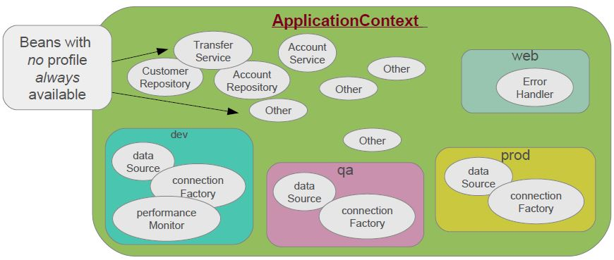
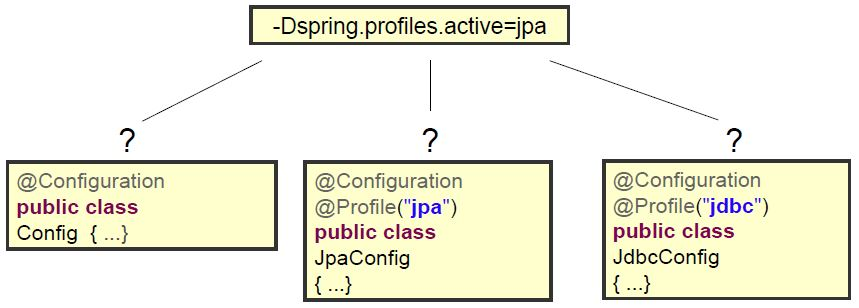
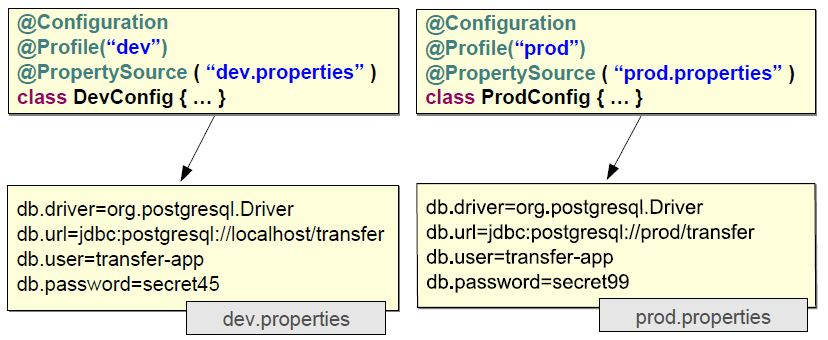

### Profiles:
Beans can be grouped into profiles.

Profiles can represent purpose "web", "offline" or environment "dev","qa","prod".
<p align="center">
  
</p>

Using **@Profile** annotation on configuration class ( all beans in configuration belong to the profile )
```java
@Configuration
@Profile("dev")
public class DevConfig{
	@Bean
	public DataSource dataSource(){
	EmbeddedDatabaseBuilder builder = new EmbeddedDatabaseBuilder();
	return builder.setName("testdb")
			.setType(EmbeddedDatabaseType.HSQL)   // HSQL H2, Derby are also supported
			.addScript("classpath:/testdb/schema.db")
			.addScript("classpath:/testdb/test-data.db")
			.build();
	}
}
```

Using **@Profile** annotation on **@Bean** methods
```java
@Configuration
public class DataSourceConfig{
	@Bean(name="dataSource")		// Explicit bean-name overrides methode name
	@Profile("dev")
	public DataSource dataSourceForDev(){
	EmbeddedDatabaseBuilder builder = new EmbeddedDatabaseBuilder();
	return builder.setName("testdb")
					//....
	}

	@Bean(name="dataSource")
	@Profile("prod")
	public DataSource dataSourceForProd(){
	BasicDataSource dataSource = new BasicDataSource();
	//...
	return dataSource;
	}
}
```
Both profiles define same bean id, so only one profile should be activated at a time.

Bean when a profile is not active
```java
@Configuration
@Profile("dev")				// dev is active profile
public class DevConfig{
...}
```
```java
@Configuration
@Profile("!dev")			// dev is inactive profile ( not dev use exclamation)
public class DevConfig{
...}
```
Profile must be activated at run-time:
* System property via command-line :
	* -Dspring.profiles.active= dev,jpa
* System property anagrammatically :
	- System.setProperty("spring.profiles.active","dev,jap");
		SpringApplication.run(AppConfig.class);
* Integration test only
	* @ActiveProfiles

Quiz: Which of the following is / are selected ?
<p align="center">
  
</p>

**@Profile** can control which **@PropertySource**
<p align="center">
  
</p>
